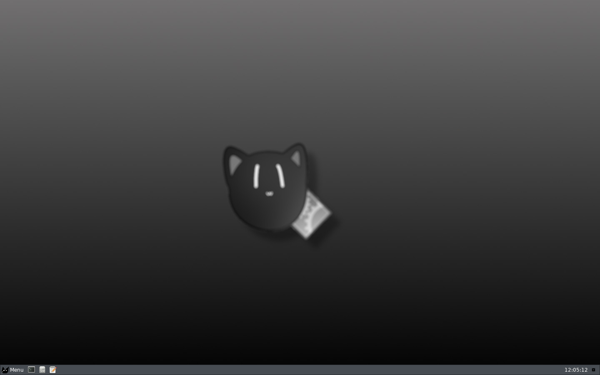
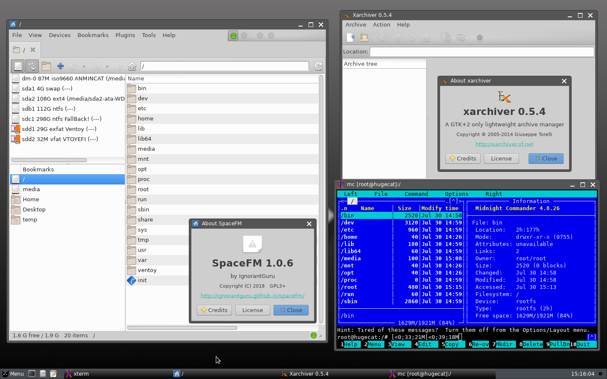
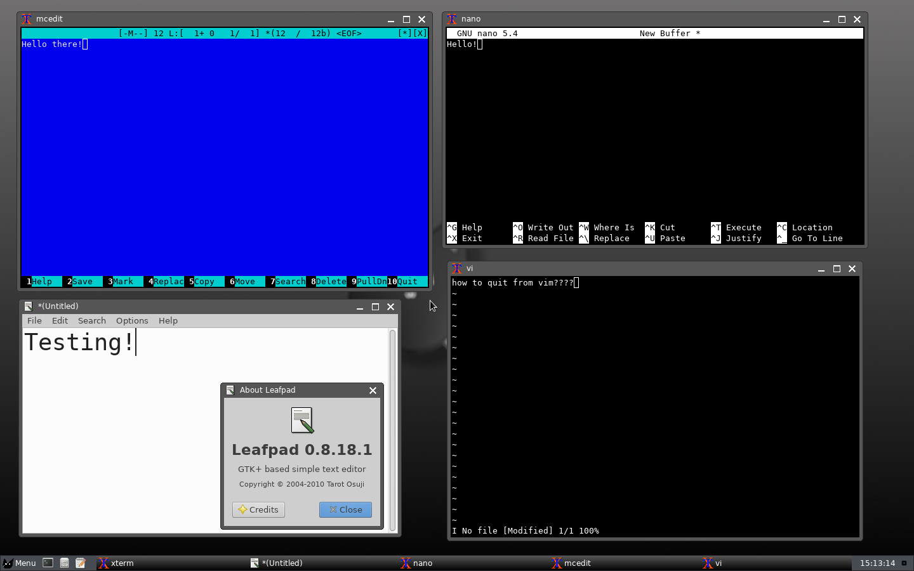
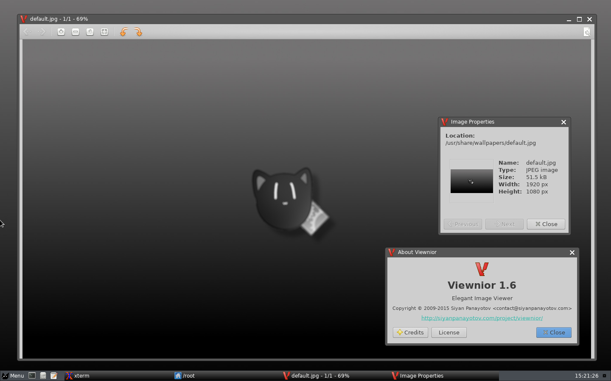
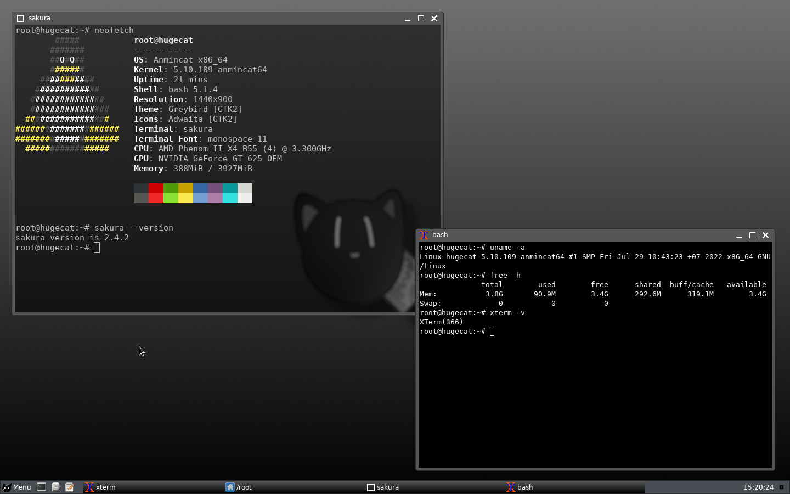
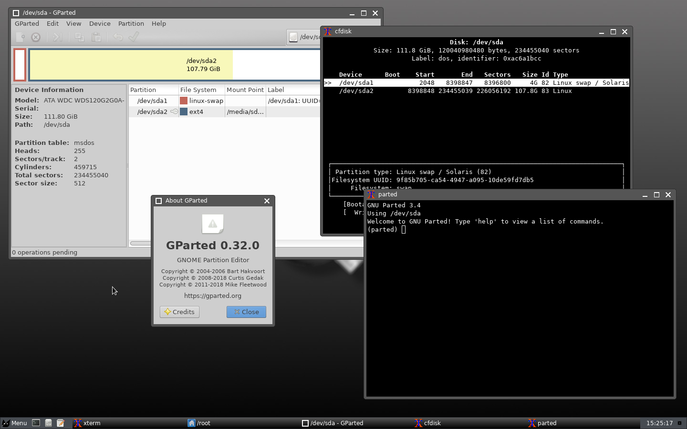
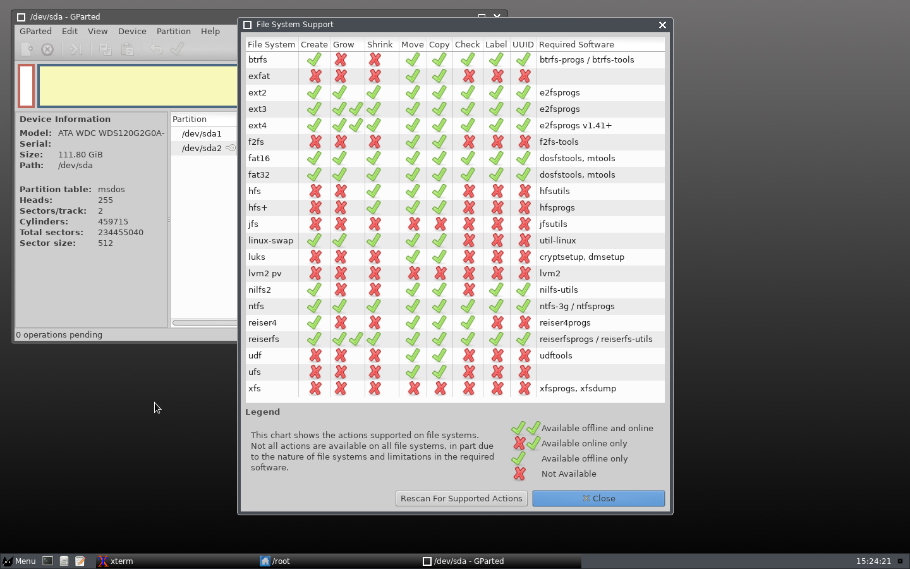
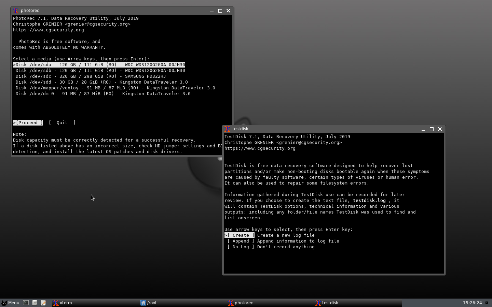
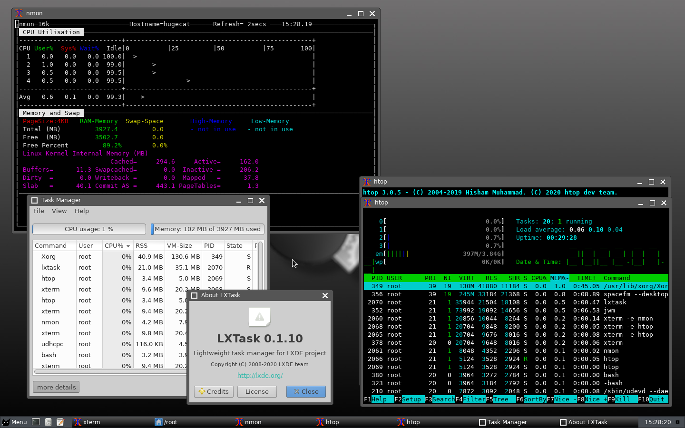
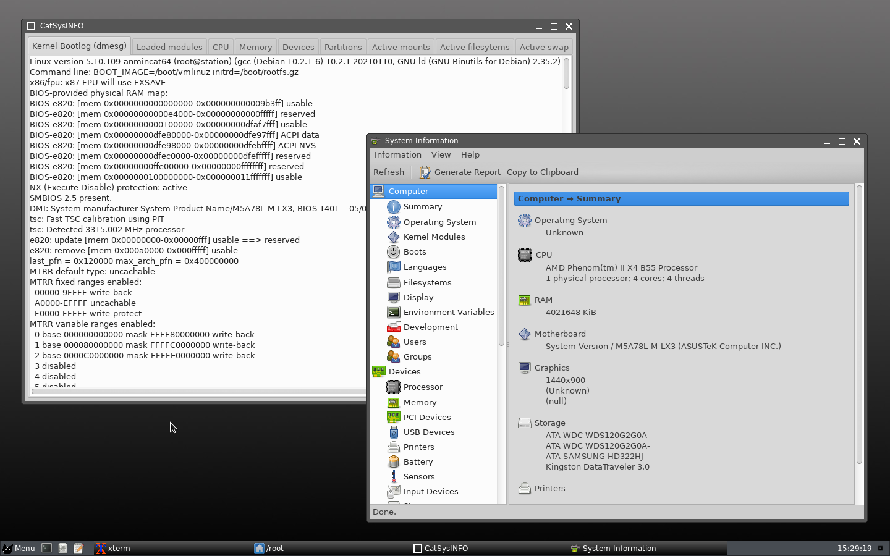

## Screenshots from version 1.8
(still in development, not release yet)

[https://github.com/Anmincat/AnmincatLinux](https://github.com/Anmincat/AnmincatLinux)

### Desktop
___

JWM (Joe's Window Manager) with Spacefm desktop

### File managers
___

Spacefm, Xarchiver and Midnight Commander

### Text editors
___

Leafpad, MCedit, Nano and Vim

### Viewer
___

Viewnior

### Terminal emulators
___

Sakura and XTerm

### Partition tools
___

Gparted, cfdisk and GNU Parted

### Filesystem Supports (GParted)
___

### Recovery Tools
___

Photorec and Testdisk

### Monitoring Tools
___

LXTask, Nmon and Htop

CatSysINFO and HardInfo
